# Week 1: Advanced Backend Foundations

This note summarizes all learning from Week 1 of the .NET Bootcamp.

## Daily Summaries
- [Day 1 Summary](Day%201%20Summary.md) (Architecture, Classes, Agile)
- [Day 2 Summary](Day%202%20Summary.md) (Properties, Abstract/Interfaces, Async, ADO.NET)
- [Day 3 Summary](Day%203%20Summary.md) (Design Patterns, Dapper, EF Core)
- [Day 4 Summary](Day%204%20Summary.md) (Layered Architecture, MVC, Diagnostics, Garbage Collection)

## Key Concepts Mastered
- **Architecture & Patterns:** Understood the [Singleton](Singleton.md), [Repository](../../Concepts/Architecture/Design%20Patterns.md), and [Publisher-Subscriber](../../Concepts/Architecture/Design%20Patterns.md) patterns. Learned what a [Model](../../Concepts/Architecture/Models.md) is, and how to structure a [Layered Architecture](../../Concepts/Architecture/Layered%20Architecture.md). Gained a basic understanding of [ASP.NET Core MVC](../../Concepts/Web%20Development/ASP.NET%20Core%20MVC.md).
- **Object-Oriented Programming (OOP):** Solid understanding of blueprints ([Classes and Objects](../../Concepts/C%23/Classes%20and%20Objects.md)), data hiding ([Properties and Backing Fields](../../Concepts/C%23/Properties%20and%20Backing%20Fields.md)), contracts ([Interfaces and Abstract Classes](../../Concepts/C%23/Interfaces%20and%20Abstract%20Classes.md)), and instance vs class scopes ([Static vs Instance Methods](../../Concepts/C%23/Static%20vs%20Instance%20Methods.md)).
- **Asynchronous & Parallel Programming:** Strong grasp of the difference between blocking threads (`Thread.Sleep`) and non-blocking timers (`Task.Delay`). Realization that `Task.WhenAll` is a coordinator, not a thread spawner. Understanding of critical sections with `lock` and data parallelism using `Parallel.For`. See [Task vs Thread](../../Concepts/Async%20Programming/Task%20vs%20Thread.md), [Blocking vs Non-Blocking](../../Concepts/Async%20Programming/Blocking%20vs%20Non-Blocking.md), and [Parallel Programming](../../Concepts/Async%20Programming/Parallel%20Programming.md).
- **Data Access & Querying:** Understanding of raw ADO.NET components, the Micro-ORM [Dapper](../../Concepts/Database/Dapper%20Basics.md), and the full ORM [Entity Framework Core](../../Concepts/Database/Entity%20Framework%20Core.md). Also learned to query collections using [LINQ Basics](../../Concepts/C%23/LINQ%20Basics.md) (`Where`, `Sum`).
- **Memory & Performance:** Understanding of [Garbage Collection](../../Concepts/C%23/Garbage%20Collection.md) generations and how to diagnose issues like CPU hotspots and memory leaks ([Performance Tuning](../../Concepts/Diagnostics/Performance%20Tuning.md)).

## Recommended Reading Sequence (Revision)
If reviewing this week's material, read in this order:
1. [Software Application Layers](../../Concepts/Architecture/Software%20Application%20Layers.md) $\rightarrow$ [Layered Architecture](../../Concepts/Architecture/Layered%20Architecture.md) (High-level)
2. [Classes and Objects](../../Concepts/C%23/Classes%20and%20Objects.md) $\rightarrow$ [Properties and Backing Fields](../../Concepts/C%23/Properties%20and%20Backing%20Fields.md) $\rightarrow$ [Static vs Instance Methods](../../Concepts/C%23/Static%20vs%20Instance%20Methods.md) $\rightarrow$ [Interfaces and Abstract Classes](../../Concepts/C%23/Interfaces%20and%20Abstract%20Classes.md) (C# Core)
3. [Exception Handling](../../Concepts/C%23/Exception%20Handling.md) $\rightarrow$ [LINQ Basics](../../Concepts/C%23/LINQ%20Basics.md) $\rightarrow$ [Collection Expressions](../../Concepts/C%23/Collection%20Expressions.md)
4. [Async vs Sync](../../Concepts/Async%20Programming/Async%20vs%20Sync.md) $\rightarrow$ [Task vs Thread](../../Concepts/Async%20Programming/Task%20vs%20Thread.md) $\rightarrow$ [Blocking vs Non-Blocking](../../Concepts/Async%20Programming/Blocking%20vs%20Non-Blocking.md) $\rightarrow$ [Parallel Programming](../../Concepts/Async%20Programming/Parallel%20Programming.md) $\rightarrow$ [Thread Safe Collections](../../Concepts/Async%20Programming/Thread%20Safe%20Collections.md) (Concurrency)
5. [ADO.NET Basics](../../Concepts/Database/ADO.NET%20Basics.md) (Data)
6. [Garbage Collection](../../Concepts/C%23/Garbage%20Collection.md) $\rightarrow$ [Performance Tuning](../../Concepts/Diagnostics/Performance%20Tuning.md) (Memory & Diagnostics)

## Learning Roadmap Update
- **Introduced:** Delegates, ASP.NET Core MVC, Performance Tuning
- **Learning:** Entity Framework Core, Layered Architecture
- **Understood:** Class architecture, OOP fundamentals, ADO.NET, LINQ, Dapper, Design Patterns, Garbage Collection
- **Mastered:** Async vs Sync mental model (Thread vs Task)

## Week 1 Concept Map

```mermaid
graph TD
    A[Week 1: Foundations] --> B(Architecture)
    A --> C(C# Core)
    A --> D(Concurrency)
    A --> E(Database)
    A --> F(Diagnostics)

    B --> B1[Software Layers]
    B --> B2[Agile Flow]
    B --> B3[Design Patterns]
    B --> B4[Layered Architecture]
    B --> B5[MVC Basics]

    C --> C1[Classes & Objects]
    C --> C2[Properties]
    C --> C3[Interfaces & Abstract]
    C --> C4[Static vs Instance]
    C --> C5[Exceptions]
    C --> C6[LINQ Basics]
    C --> C7[Collection Expressions]
    C --> C8[Garbage Collection]

    D --> D1[Async vs Sync]
    D --> D2[Task vs Thread]
    D --> D3[Blocking vs Non-Blocking]
    D --> D4[Parallel Programming]
    D --> D5[Concurrent Collections]

    E --> E1[ADO.NET]
    E --> E2[Dapper]
    E --> E3[Entity Framework Core]
    
    F --> F1[Performance Tuning]
```

