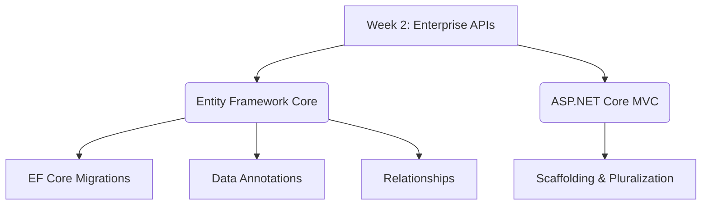

# Week 2: Enterprise APIs & AI-Assisted Debugging

This note summarizes all learning from Week 2 of the .NET Bootcamp.

## Daily Summaries
- [Day 6 Summary](Day%206%20Summary.md) (EF Core Migrations, Relationships, and MVC Scaffolding)

## Key Concepts Mastered
- **Database & Entity Framework Core:** Deepened understanding of ORMs with EF Core. Learned how [EF Core Migrations](../../Concepts/Database/EF%20Core%20Migrations.md) map C# code to database schemas and track changes. Mastered the use of [EF Core Data Annotations](../../Concepts/Database/EF%20Core%20Data%20Annotations.md) for UI hints and schema constraints, and understood how to build [EF Core Relationships](../../Concepts/Database/EF%20Core%20Relationships.md) (1:1, 1:N).
- **ASP.NET Core MVC:** Experienced Visual Studio scaffolding quirks, specifically around pluralization in [ASP.NET Core MVC](../../Concepts/Web%20Development/ASP.NET%20Core%20MVC.md).

## Recommended Reading Sequence (Revision)
1. [EF Core Migrations](../../Concepts/Database/EF%20Core%20Migrations.md) (Workflow & Commands)
2. [EF Core Data Annotations](../../Concepts/Database/EF%20Core%20Data%20Annotations.md) (Constraints & Validation)
3. [EF Core Relationships](../../Concepts/Database/EF%20Core%20Relationships.md) (Foreign Keys & ICollection)

## Learning Roadmap Update
- **Introduced:** EF Core Migrations, EF Core Relationships, EF Core Data Annotations.

## Week 2 Concept Map

