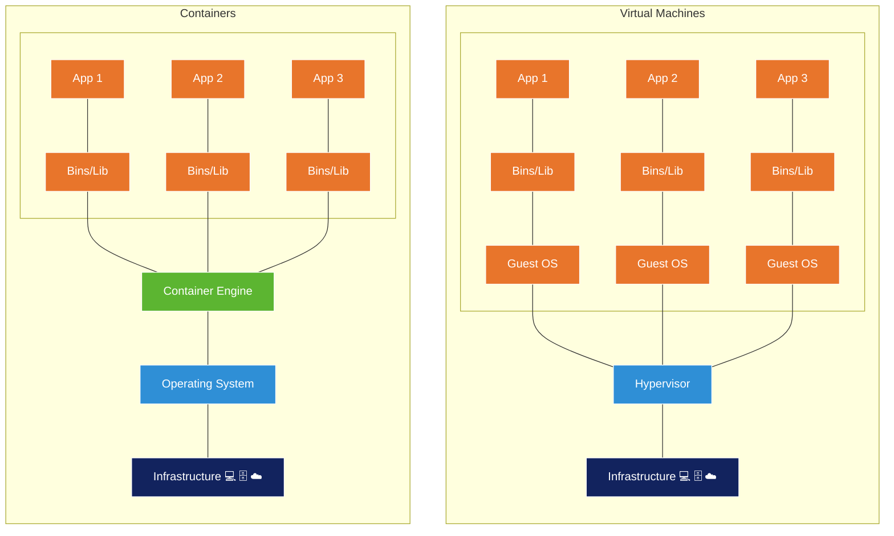

# 01 - Microservices Architecture

### Open Questions (from the session)

- Is scaling just "replicate the same codebase across servers"?
- How do containers fit into the picture?
- Do you containerise **each feature/service** individually? Is that how the industry does it, and how does it work?
- Where do Podman and Docker fit?
- How important is infrastructure?
- Where does Cassandra fit?
- How do containers communicate — via service buses?

### Key Concepts

> [!NOTE]
> The following expands on the original questions with accurate reference material. It was **not** in the raw note — treat it as added context to verify against course material.

- **Scaling is not blind replication.** Copying the entire monolith onto more servers scales every feature equally, even though some features receive far more traffic than others. This wastes resources on low-demand features and under-provisions hot ones.
- **Independent scalability is the core driver.** Splitting the system into services lets each service scale on its own based on its actual load and performance profile.
- **Each service is containerised independently.** A container packages one service with its dependencies into a portable, isolated unit. This is the standard industry approach — it enables per-service deployment, scaling, and technology choice.
- **Polyglot persistence & polyglot programming.** Each service can pick the language and database that best fit its workload (see the reference architecture below).
- **Infrastructure is a first-class concern.** Orchestration, networking, and communication between services are as important as the service code itself.
- **Inter-service communication.** Services communicate over the network — synchronously via REST APIs, and asynchronously via a **message/service bus** for decoupled, event-driven flows.

### Container Runtimes

| Runtime | Notes |
|---------|-------|
| **Docker** | The most widely used container runtime and tooling ecosystem. |
| **Podman** | Daemonless, rootless-capable alternative; largely CLI-compatible with Docker. |

### Reference Architecture

A web server fronts a platform of independently deployed services. Each service exposes a REST API and owns its own database, with the technology chosen to match its workload:

| Service | Language | Database | Rationale |
|---------|----------|----------|-----------|
| Supplier Management | .NET | MySQL | Easy to use, widely available, lightweight, predictable load |
| Product Management | Python | Cassandra | High scalability, availability, and performance |
| Cost Management | Node.js | Couchbase | Low latency, simple admin, high availability, powerful query language |
| Price Management | Node.js | Couchbase | Low latency, simple admin, high availability, powerful query language |
| Stock Management | Python | Redis + MongoDB | Redis cache layer over a MongoDB schema — high performance with simplicity |
| Finance | Java | MySQL | Easy to use, widely available, lightweight, predictable load |
| CRM | Java | Oracle | Most popular, reliable, caters to varied use cases |

```mermaid
%%{init: {'theme':'base','securityLevel':'loose','flowchart':{'htmlLabels':true,'curve':'linear','nodeSpacing':30,'rankSpacing':28}} }%%
flowchart LR

    user([User]):::user --> web((Web<br/>Server)):::web --> dock[" "]:::hidden

    subgraph PLATFORM[" "]
        direction LR
        dock

        subgraph STACK[" "]
            direction TB

            subgraph R1[" "]
                direction LR
                api1["Rest API"]:::api
                s1["Supplier<br/>Management"]:::supplier
                tech1["<div style='display:flex;align-items:center;gap:6px'><img src='https://cdn.simpleicons.org/dotnet/512BD4' height='18'/><span>Microsoft .NET</span></div>"]:::brand
                cyl1[( )]:::cyl
                db1["<div style='display:flex;align-items:center;gap:6px'><img src='https://cdn.simpleicons.org/mysql/4479A1' height='18'/><span>MySQL</span></div>"]:::brand
                note1["Easy to use, Widely available,<br/>light weight, predictable load"]:::note
                api1 ~~~ s1
                s1 --- tech1 --- cyl1
                cyl1 ~~~ db1
                db1 ~~~ note1
            end

            subgraph R2[" "]
                direction LR
                api2["Rest API"]:::api
                s2["Product<br/>Management"]:::product
                tech2["<div style='display:flex;align-items:center;gap:6px'><img src='https://cdn.simpleicons.org/python/3776AB' height='18'/><span>python</span></div>"]:::brand
                cyl2[( )]:::cyl
                db2["<div style='display:flex;align-items:center;gap:6px'><img src='https://cdn.simpleicons.org/apachecassandra/1287B1' height='18'/><span>cassandra</span></div>"]:::brand
                note2["High Scalability, high availability<br/>and high performance"]:::note
                api2 ~~~ s2
                s2 --- tech2 --- cyl2
                cyl2 ~~~ db2
                db2 ~~~ note2
            end

            subgraph R3[" "]
                direction LR
                api3["Rest API"]:::api
                s3["Cost<br/>Management"]:::cost
                tech3["<div style='display:flex;align-items:center;gap:6px'><img src='https://cdn.simpleicons.org/nodedotjs/5FA04E' height='18'/><span>node</span></div>"]:::brand
                cyl3[( )]:::cyl
                db3["<div style='display:flex;align-items:center;gap:6px'><img src='https://cdn.simpleicons.org/couchbase/EA2328' height='18'/><span>Couchbase</span></div>"]:::brand
                note3["Low latency, Simple administration,<br/>High Availability, Powerful Query language"]:::note
                api3 ~~~ s3
                s3 --- tech3 --- cyl3
                cyl3 ~~~ db3
                db3 ~~~ note3
            end

            subgraph R4[" "]
                direction LR
                api4["Rest API"]:::api
                s4["Price<br/>Management"]:::price
                tech4["<div style='display:flex;align-items:center;gap:6px'><img src='https://cdn.simpleicons.org/nodedotjs/5FA04E' height='18'/><span>node</span></div>"]:::brand
                cyl4[( )]:::cyl
                db4["<div style='display:flex;align-items:center;gap:6px'><img src='https://cdn.simpleicons.org/couchbase/EA2328' height='18'/><span>Couchbase</span></div>"]:::brand
                note4["Low latency, Simple administration,<br/>High Availability, Powerful Query language"]:::note
                api4 ~~~ s4
                s4 --- tech4 --- cyl4
                cyl4 ~~~ db4
                db4 ~~~ note4
            end

            subgraph R5[" "]
                direction LR
                api5["Rest API"]:::api
                s5["Stock<br/>Management"]:::stock
                tech5["<div style='display:flex;align-items:center;gap:6px'><img src='https://cdn.simpleicons.org/python/3776AB' height='18'/><span>python</span></div>"]:::brand
                cyl5[( )]:::cyl
                db5["<div style='display:flex;align-items:center;gap:8px'><img src='https://cdn.simpleicons.org/redis/DC382D' height='18'/><span>redis</span><img src='https://cdn.simpleicons.org/mongodb/47A248' height='18'/><span>mongoDB</span></div>"]:::brandWide
                note5["A cache layer on Redis and database schema on Mongo.<br/>Super high performance with simplicity"]:::note
                api5 ~~~ s5
                s5 --- tech5 --- cyl5
                cyl5 ~~~ db5
                db5 ~~~ note5
            end

            subgraph R6[" "]
                direction LR
                api6["Rest API"]:::api
                s6["Finance"]:::finance
                tech6["<div style='display:flex;align-items:center;gap:6px'><img src='https://cdn.simpleicons.org/openjdk/EA2D2E' height='18'/><span>java</span></div>"]:::brand
                cyl6[( )]:::cyl
                db6["<div style='display:flex;align-items:center;gap:6px'><img src='https://cdn.simpleicons.org/mysql/4479A1' height='18'/><span>MySQL</span></div>"]:::brand
                note6["Easy to use, Widely available,<br/>light weight, predictable load"]:::note
                api6 ~~~ s6
                s6 --- tech6 --- cyl6
                cyl6 ~~~ db6
                db6 ~~~ note6
            end

            subgraph R7[" "]
                direction LR
                api7["Rest API"]:::api
                s7["CRM"]:::crm
                tech7["<div style='display:flex;align-items:center;gap:6px'><img src='https://cdn.simpleicons.org/openjdk/EA2D2E' height='18'/><span>java</span></div>"]:::brand
                cyl7[( )]:::cyl
                db7["<div style='display:flex;align-items:center;gap:6px'><img src='https://cdn.simpleicons.org/oracle/F80000' height='18'/><span>ORACLE</span></div>"]:::brand
                note7["Most popular, reliable, can cater<br/>to various use cases"]:::note
                api7 ~~~ s7
                s7 --- tech7 --- cyl7
                cyl7 ~~~ db7
                db7 ~~~ note7
            end

            s1 ~~~ s2
            s2 ~~~ s3
            s3 ~~~ s4
            s4 ~~~ s5
            s5 ~~~ s6
            s6 ~~~ s7
        end

        dock ~~~ s4
    end

    classDef user fill:#5B7FDB,stroke:#4B6FC6,stroke-width:1px,color:#FFFFFF;
    classDef web fill:#E59A63,stroke:#D37F42,stroke-width:1px,color:#000000;
    classDef api fill:#000000,stroke:#000000,stroke-width:1px,color:#E7E11C;
    classDef supplier fill:#4E596D,stroke:#3F495C,stroke-width:1px,color:#FFFFFF;
    classDef product fill:#5A84DB,stroke:#4670C8,stroke-width:1px,color:#FFFFFF;
    classDef cost fill:#E1863E,stroke:#C96F28,stroke-width:1px,color:#FFFFFF;
    classDef price fill:#BDBDBD,stroke:#A8A8A8,stroke-width:1px,color:#FFFFFF;
    classDef stock fill:#F0C437,stroke:#D7AC1E,stroke-width:1px,color:#FFFFFF;
    classDef finance fill:#6EA6D6,stroke:#5A91C1,stroke-width:1px,color:#FFFFFF;
    classDef crm fill:#83C25A,stroke:#6FA847,stroke-width:1px,color:#FFFFFF;
    classDef cyl fill:#5A7FCE,stroke:#456AB8,stroke-width:1px,color:#FFFFFF;
    classDef brand fill:transparent,stroke:transparent,color:#111111;
    classDef brandWide fill:transparent,stroke:transparent,color:#111111;
    classDef note fill:transparent,stroke:transparent,color:#5B5B5B;
    classDef hidden fill:transparent,stroke:transparent,color:transparent;

    style PLATFORM fill:#FFFFFF,stroke:#333333,stroke-width:1px
    style STACK fill:transparent,stroke:transparent
    style R1 fill:#F9F9F9,stroke:#7E86AA,stroke-width:1px
    style R2 fill:#F9F9F9,stroke:#7E86AA,stroke-width:1px
    style R3 fill:#F9F9F9,stroke:#7E86AA,stroke-width:1px
    style R4 fill:#F9F9F9,stroke:#7E86AA,stroke-width:1px
    style R5 fill:#F9F9F9,stroke:#7E86AA,stroke-width:1px
    style R6 fill:#F9F9F9,stroke:#7E86AA,stroke-width:1px
    style R7 fill:#F9F9F9,stroke:#7E86AA,stroke-width:1px

    linkStyle default stroke:#5B80C8,stroke-width:2px
```

### Virtual Machines vs. Containers

Containers are lighter-weight than virtual machines. Each VM runs a **full guest OS** on top of a hypervisor, whereas containers **share the host operating system's kernel** through a container engine and package only the application plus its binaries/libraries. This is why containers start faster and pack more densely onto a host — and why "containerise each service" is practical at scale.

