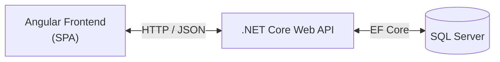

# 01 - The Orchestrator Mindset and System Context
 
**Technology stack:** .NET Core Web API · Angular · SQL Server via Entity Framework Core · Podman/Docker
**Case study:** Employee Leave Management System
 
## The orchestrator mindset
 
Instead of writing everything from scratch, the modern engineer acts as an **orchestrator** alongside an AI assistant (ChatGPT/GPT-4, Claude, etc.):
 
1. **Design** high-level specifications and contracts.
2. **Delegate** scaffolding and boilerplate to the AI.
3. **Critically evaluate** the AI's output — never accept it blindly.
4. **Harden** with tests, a security checklist, and resilience targets.
5. **Containerize** and ship.
 
> [!IMPORTANT] The engineer stays the architect
> AI accelerates *production of code*, not *ownership of decisions*. Every AI artifact in this workflow — scaffold, contract, diagram, checklist — is treated as a **draft to be reviewed and challenged**, not a finished answer. The "AI self-criticism" step (Phase 4) is where this mindset is made explicit.
 
## System context
 
At the highest level the system is a classic three-tier web application:
 

 
- **Angular SPA** — presentation and client-side validation.
- **.NET Core Web API** — routing, business logic, model validation, the authoritative gate.
- **SQL Server via EF Core** — persistence; EF Core is the ORM mapping C# entities to relational tables.
