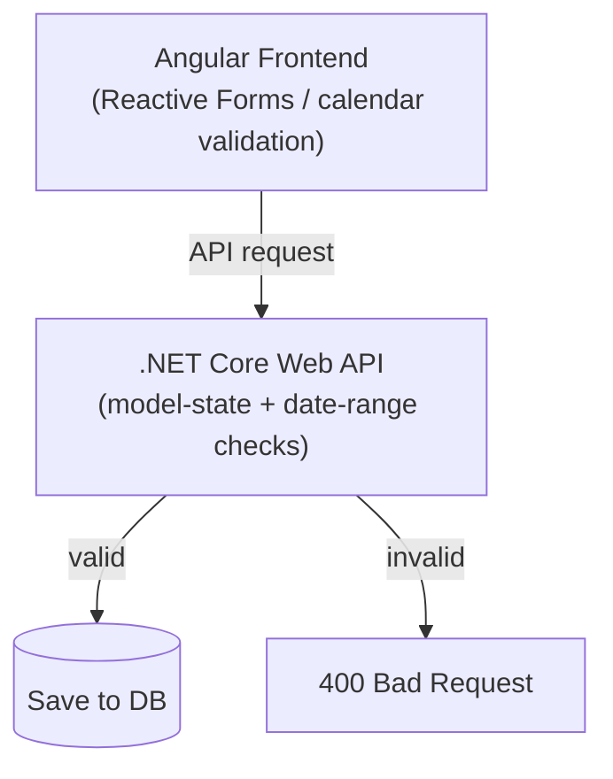

# 03 - Phase 2 - Defining validation & edge cases
 
Production-readiness means prompting the AI for **edge cases**, not just the happy path.
 
### Critical edge cases (Leave Management)
 
1. **Empty / whitespace names** — reject an `EmployeeName` that is only spaces, not merely `null`/empty. (`string.IsNullOrWhiteSpace` vs. `string.IsNullOrEmpty` — see callout.)
2. **Identical dates** — `FromDate == ToDate` is valid (a one-day leave); don't reject it.
3. **Invalid date range** — reject `FromDate` *after* `ToDate` (e.g. 28 Jul → 25 Jul).
4. **Missing mandatory properties** — block the request if `EmployeeId` or `LeaveType` is absent.
 
> [!WARNING] `IsNullOrEmpty` misses whitespace
> `string.IsNullOrEmpty("   ")` returns **`false`** — the string has length. Use **`string.IsNullOrWhiteSpace`** to also catch spaces/tabs/newlines. This is exactly edge case #1.
 
### Dual-layer validation architecture
 
Validation must live at **both** layers:
 
- **Frontend (Angular)** — Reactive (or template-driven) Forms; the date-picker disables past dates and invalid ranges so users can't easily submit bad input. This is a **UX** concern.
- **Backend (.NET Core API)** — the **final line of defense**. If a client bypasses the UI (intercepted call, script, Postman), model-state validation returns **`400 Bad Request`**. This is a **security/integrity** concern.
 

 
> [!IMPORTANT] Never trust the client
> Frontend validation is for user experience; it can always be bypassed. The backend must **re-validate everything**. Treat the two layers as independent — the API must be correct even if the Angular app didn't exist.
