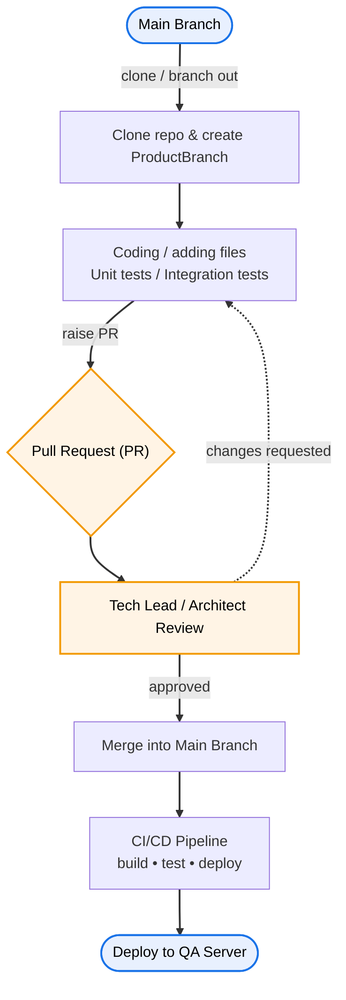

# 01 - CI-CD Pipeline
 
**CI/CD** = **Continuous Integration / Continuous Delivery (or Deployment)**.
 
- **Continuous Integration (CI)** — every change is merged into a shared branch frequently; each merge automatically triggers a **build** and **automated tests**, catching integration problems early.
- **Continuous Delivery (CD)** — every change that passes CI is packaged and made **ready to release** (deployed to QA/staging, with a manual approval before production).
- **Continuous Deployment** — the stricter variant: passing changes go **all the way to production automatically**, no manual gate.
 
> [!IMPORTANT] Why branch off `main` instead of committing to it directly?
> Committing straight to `main` means unreviewed, possibly broken code lands in the branch everyone deploys from. A short-lived **feature branch + Pull Request** gives you a review gate and an automated check gate *before* the code can affect anyone else.
 
### The branch-to-deploy flow
 

 
**Step-by-step:**
 
1. **Branch out** from `main` into a short-lived feature/product branch.
2. **Do the work** — add code and write **unit** and **integration** tests (see **Part 1 → Phase 3** for the full testing strategy).
3. **Raise a Pull Request (PR)** to merge the branch back into `main`.
4. **Review** by a tech lead / architect. Approved → merge. Changes requested → loop back to step 2.
5. **Merge into `main`** triggers the **CI/CD pipeline** (`build → test → deploy`).
6. **Deploy to the QA server** (and onward to further environments).
