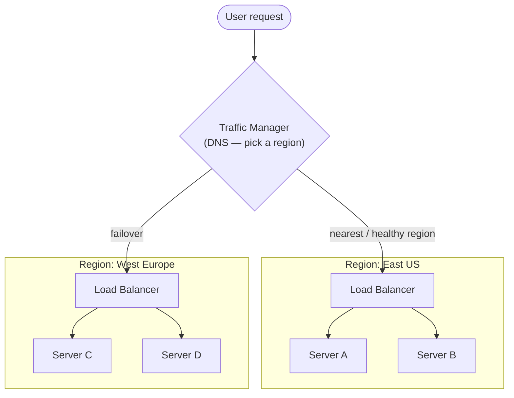

# 04 - Load Balancer vs. Traffic Manager
 
Two different layers of "spread the load", often confused:
 
| | **Load Balancer** | **Traffic Manager** |
| --- | --- | --- |
| **Layer** | Across servers/VMs **within a region** | Across **regions/endpoints** |
| **Mechanism** | Network-level (Azure Load Balancer = L4/TCP-UDP; Application Gateway = L7/HTTP) | **DNS-based** — returns the address of the best endpoint |
| **Answers** | "Which healthy server handles this request?" | "Which region/data-center should this user reach?" |
| **Typical use** | Scale-out & HA within a region | Global failover, geo-routing, latency routing |
 

 
> [!NOTE] The key distinction
> **Traffic Manager works at the DNS level**, so it decides *before* the connection is made and cannot see individual requests. A **Load Balancer** sits in the actual request path within a region and balances per-connection. They compose: Traffic Manager picks the region, the region's Load Balancer picks the server. (This is the infrastructure realization of the **Disaster Recovery** targets in **Part 1 → Phase 6**.)
