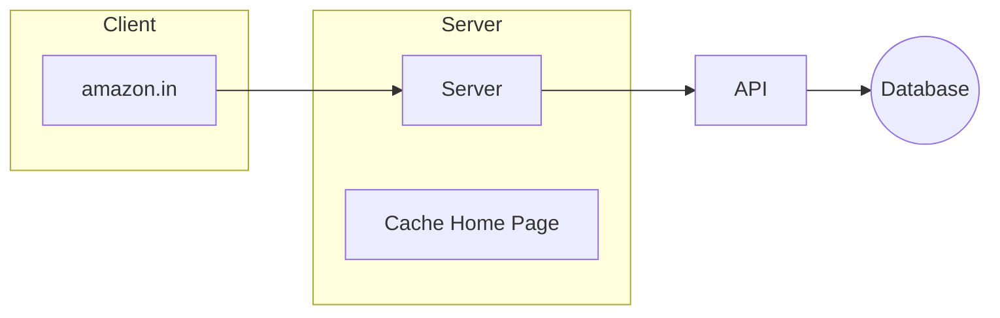

# Caching and Minification

## Caching
Caching is the process of storing copies of data in a temporary storage location for quick access. 
- **Types of Cache:** Client cache, Server cache, Disk cache.

> [!NOTE]
> A common benchmark for page loading is 3 seconds. To test performance without cache during development, you can open your browser's Developer Tools -> Network -> Disable cache.

## Minification
Minification is the process of minimizing code and markup in your web pages and script files.
- We minify files (especially JavaScript files) sent over the internet to reduce payload size.
- Browsers don't need pretty, formatted code to execute it; formatting is only for humans.
