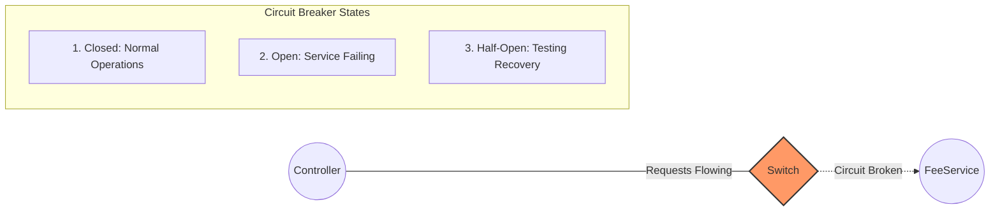

# Circuit Breaker Pattern

The Circuit Breaker pattern is used to detect failures and encapsulate the logic of preventing a failure from constantly recurring, during maintenance, temporary external system failure or unexpected system difficulties. 

## States

1. **Closed**: Normal state. All requests are routed to the downstream service (e.g., `FeeService`).
2. **Open**: Triggered after a failure threshold is met. Requests fail instantly to save resources and prevent overwhelming the struggling downstream service.
3. **Half-Open**: A trial state to check if the downstream service is back online. A limited number of test requests are allowed through. If they succeed, the circuit closes; if they fail, the circuit opens again.

## Use Case
This pattern is often combined with **Retry Patterns**. A retry loop handles transient errors (like temporary network timeouts). However, if a service is completely down, repeatedly retrying just wastes resources. A circuit breaker stops the retries entirely until the service is healthy again.
