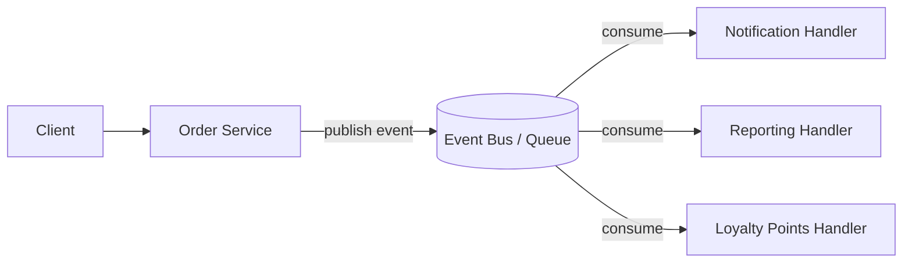
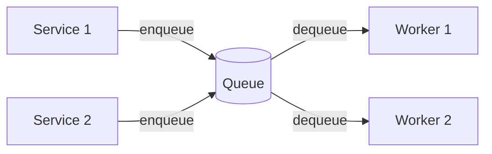

# Publish-Subscribe (Pub/Sub) Pattern

The Publish-Subscribe (Pub/Sub) pattern is a messaging pattern where senders of messages (publishers) do not programmatically send them directly to specific receivers (subscribers). Instead, published messages are sent to an Event Bus or Message Broker, and subscribers express interest in one or more classes of messages.

This pattern is highly effective for decoupling side-effects from the main synchronous request path.

## The Problem with Synchronous Side-Effects
If an `OrderService` needs to generate an invoice, update a restaurant dashboard, and send an SMS notification after placing an order, doing all of this synchronously causes issues:
- **Performance:** The user has to wait for the SMS gateway to respond before getting their HTTP 201 Created response.
- **Reliability:** If the SMS gateway is down, the entire order placement fails, even though the core business transaction (payment and order creation) succeeded.
- **Coupling:** Adding a new side-effect (e.g., adding Loyalty Points) requires changing the `OrderService` code.

## The Pub/Sub Solution
Instead of performing side-effects directly, the `OrderService` publishes a domain event (e.g., `OrderPlacedEvent`) to an **Event Bus**. Background workers or specialized handlers subscribe to this event and process the side-effects asynchronously.

### Example Architecture

### Adding New Features
The greatest strength of Pub/Sub is that adding a new reaction to an event (like `LoyaltyPointsOrderPlacedHandler`) requires **zero changes** to the publisher (`OrderService`). You simply create a new handler and register it. This perfectly adheres to the Open-Closed Principle.

## Message Queues
In enterprise systems, the Event Bus is often powered by robust message brokers like Kafka, RabbitMQ, or Azure Service Bus.

