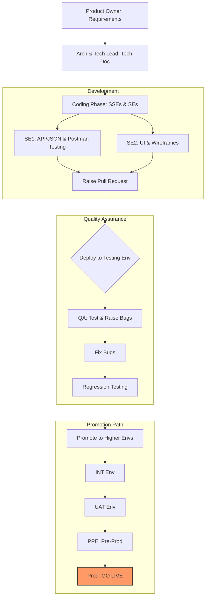

# Software Development Life Cycle (SDLC)

## Wireframing
- Wireframes should be used in place of actual images while developing the UI. They give a general idea of the layout and structure without getting bogged down in high-fidelity design details early on.

## Promotion Path & Workflow

Below is a standard development lifecycle and promotion path showing how code moves from requirements all the way to production.

### Key Environments:
- **INT**: Integration Environment
- **UAT**: User Acceptance Testing Environment
- **PPE**: Pre-Production Environment (staging)
- **Prod**: Production (Live)
