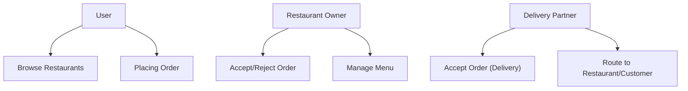
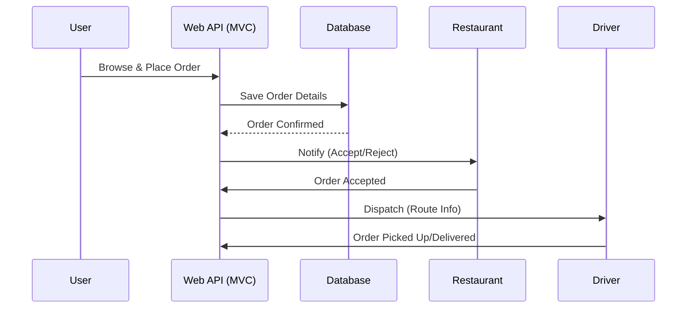
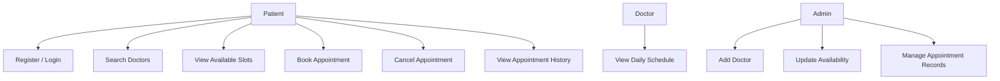
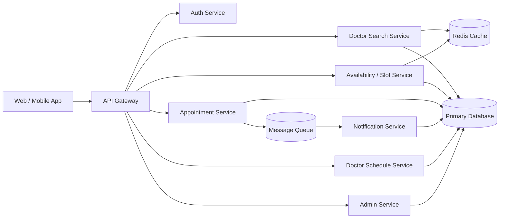
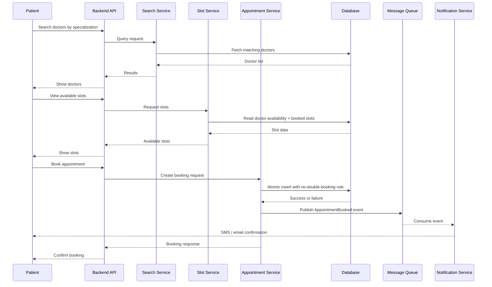
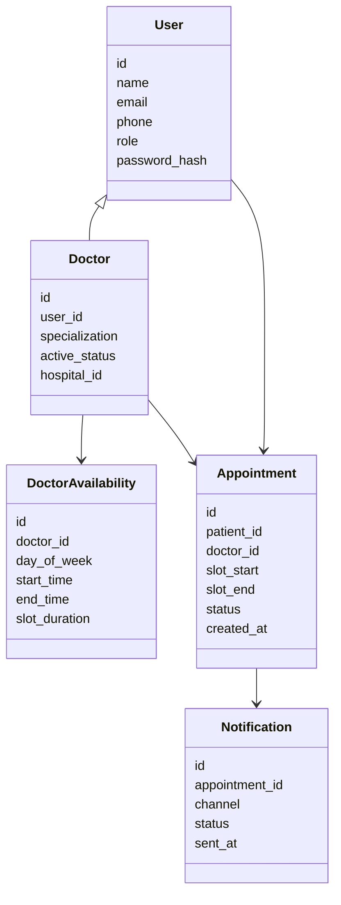

# High Level System Design

## 1. Intro Example: Food Delivery App

When designing a system, we first identify the actors (users, restaurants, delivery partners) and map out their interactions.

### Food Delivery Booking Flow

---

## 2. Deep Dive: Hospital Appointment System

The core problem in a hospital booking system is preventing double booking while providing extremely fast search results for patients.

### 2.1 Users and Use Cases

- **Patient:** Register, login, search doctors, view slots, book, cancel, and view history.
- **Doctor:** View daily schedule and patient appointments.
- **Admin:** Add doctors, edit availability, and manage appointment records.

### 2.2 High-Level Architecture

We break the system into modular microservices (Search, Slot, Appointment, Notification).

### 2.3 Booking Flow

Patients search doctors, view live slots, book appointments, and receive async confirmations. The most important correctness rule is preventing double-booking.

### 2.4 Suggested Data Model

### 2.5 Key Design Decisions
1. **Search caching:** Use Redis for fast search and availability reads.
2. **Dynamic Slot Generation:** Generate slots from schedule data instead of storing every possible slot forever.
3. **Atomic DB Booking:** Use atomic DB transactions or unique constraints to avoid double-booking ([See Race Conditions](../Database/Race%20Conditions%20and%20Locking.md)).
4. **Async Notifications:** Do booking and notification separately. Send confirmation messages asynchronously using a Message Queue so the booking stays fast and doesn't fail if the email service goes down.
