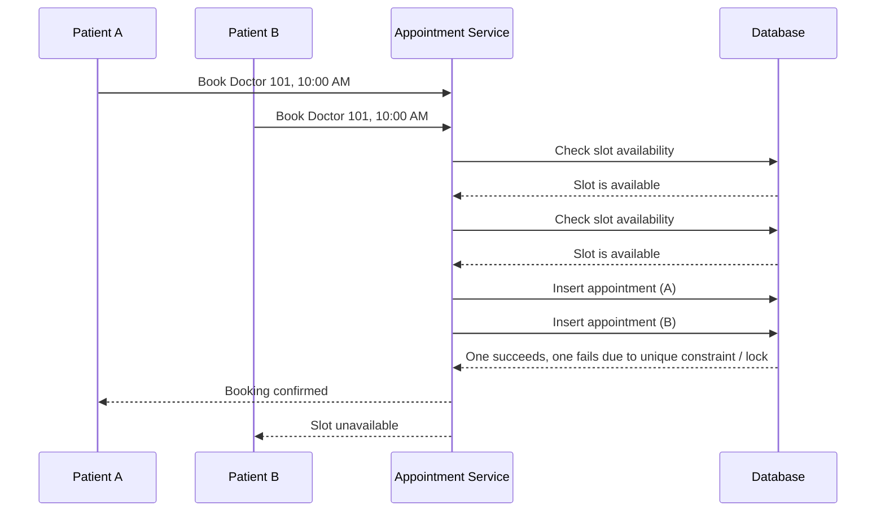

# Race Conditions and Locking

A common bug in concurrent applications is a race condition. In database design (like a booking system), a race happens between a read and a write.

## The Double-Booking Race Condition

Assume a doctor has one slot available at 10:00 AM. Two patients try to book it at the exact same time.

A common bug is this flow:
1. Request reads: "slot is free"
2. Request waits a little
3. Request inserts the appointment

If two requests do this together, both can read the same free slot before either write commits.

## How the Database Prevents It

The database resolves it so only one appointment is saved. The database must be the source of truth, not the UI check. The UI check is only a hint. Two common mechanisms prevent double booking under the hood:

### 1. Unique Index Conflict
If the booking table has a unique constraint key like `(doctor_id, slot_start)`, the database will automatically create a unique B-tree index. The second insert for the same slot cannot create a duplicate entry in that index. The database will reject that write, and the application returns "slot unavailable".

### 2. Row-Level Locking
If the code first selects the slot row `FOR UPDATE`, PostgreSQL takes a row-level lock. This blocks other writers and lockers on the same row until the current transaction ends. 
- Transaction A walks up and places a temporary claim on the seat.
- Transaction B arrives at the same time and must wait.
- When A commits, the claim becomes permanent.
- B re-checks the row and sees it is already booked.

## Best Design Summary
- Use a booking table with a unique constraint on `(doctor_id, slot_start)`.
- Wrap the booking in an atomic transaction.
- Optionally lock the slot row with `SELECT ... FOR UPDATE`.
- On conflict, roll back and return "slot already booked".
