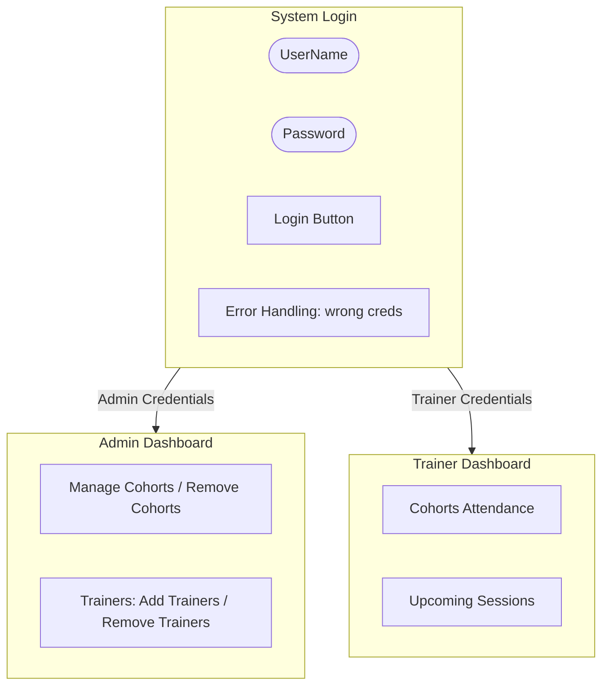

# Authentication and Authorization

In a robust Web API, endpoints often need to be secured so that only verified users (Authentication) with the correct privileges (Authorization) can access them.

## Basic Setup Flow

1. **Authentication (Who are you?)**: 
   - The client sends credentials (e.g., username/password) to a `/login` endpoint.
   - The server validates them against a datastore.
   - If valid, the server generates and returns a **JSON Web Token (JWT)**.
   
2. **Authorization (What can you do?)**:
   - The client attaches the JWT to the `Authorization: Bearer <token>` header for subsequent requests.
   - Controllers or specific endpoints are marked with the `[Authorize]` attribute.
   - To restrict access to specific roles, use `[Authorize(Roles = "Admin")]`.

## Role-Based Access Control Example

### Controllers

```csharp
// 1. Public Endpoint (No auth required)
[Route("api/[controller]")]
[ApiController]
public class PublicController : ControllerBase
{
    [HttpGet]
    public IActionResult GetPublicData()
    {
        return Ok(new { Message = "This is public data. Anyone can access this." });
    }
}

// 2. Secure Endpoint (Must be logged in, any role)
[Route("api/[controller]")]
[ApiController]
[Authorize]
public class SecureController : ControllerBase
{
    [HttpGet("profile")]
    public IActionResult GetProfile()
    {
        string username = User.Identity?.Name ?? "";
        string fullName = User.FindFirst("FullName")?.Value ?? "";
        string role = User.FindFirst(System.Security.Claims.ClaimTypes.Role)?.Value ?? "";

        return Ok(new
        {
            Username = username,
            FullName = fullName,
            Role = role,
            Message = "You are authenticated."
        });
    }
}

// 3. Admin-Only Endpoint
[Route("api/[controller]")]
[ApiController]
[Authorize(Roles = "Admin")]
public class AdminController : ControllerBase
{
    [HttpGet("dashboard")]
    public IActionResult GetAdminDashboard()
    {
        return Ok(new { Message = "Welcome Admin. You can access the admin dashboard." });
    }
}

// 4. Trainer-Only Endpoint
[Route("api/[controller]")]
[ApiController]
[Authorize(Roles = "Trainer")]
public class TrainerController : ControllerBase
{
    [HttpGet("sessions")]
    public IActionResult GetTrainerSessions()
    {
        return Ok(new { Message = "Welcome Trainer. These are your training sessions." });
    }
}
```

## JWT Token Generation Logic

Tokens are generated by signing a set of claims with a secret key. 

```csharp
private string GenerateJwtToken(AppUser user)
{
    // These should be configured in appsettings.json
    string secretKey = configuration["JwtSettings:SecretKey"]!;
    string issuer = configuration["JwtSettings:Issuer"]!;
    string audience = configuration["JwtSettings:Audience"]!;
    int expiryInMinutes = configuration.GetValue<int>("JwtSettings:ExpiryInMinutes");

    var securityKey = new SymmetricSecurityKey(Encoding.UTF8.GetBytes(secretKey));
    var credentials = new SigningCredentials(securityKey, SecurityAlgorithms.HmacSha256);

    // Claims define the data packed into the token payload
    var claims = new List<Claim>
    {
        new Claim(ClaimTypes.NameIdentifier, user.UserId.ToString()),
        new Claim(ClaimTypes.Name, user.Username),
        new Claim("FullName", user.FullName),
        new Claim(ClaimTypes.Role, user.Role)
    };

    var token = new JwtSecurityToken(
        issuer: issuer,
        audience: audience,
        claims: claims,
        expires: DateTime.Now.AddMinutes(expiryInMinutes),
        signingCredentials: credentials);

    return new JwtSecurityTokenHandler().WriteToken(token);
}
```

## Dashboard Access Flow


