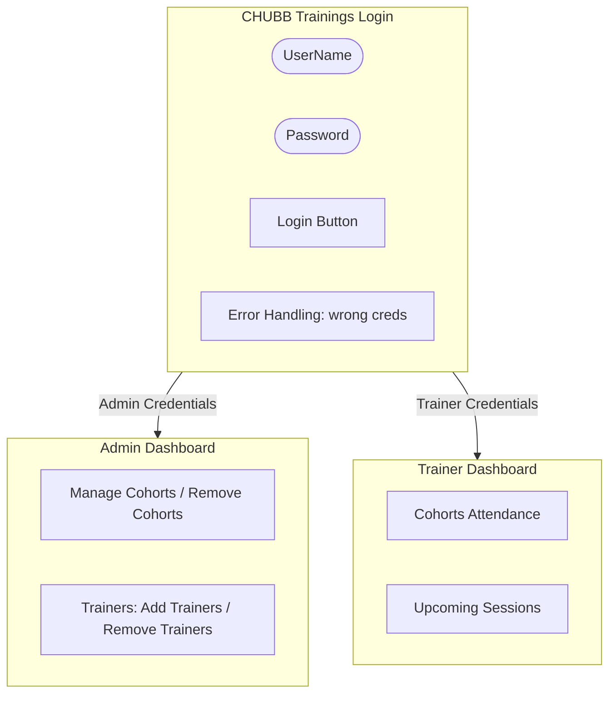

# JWT Authorization Flow Demo

## Authentication Flow and Role-Based Access Control

The authentication and authorization flow using JSON Web Tokens (JWT) generally follows these steps:



### How Authorization Works End-to-End
1. The user enters a username and password on the login screen.
2. The `AuthController` sends those credentials to the `AuthService`.
3. `AuthService` checks whether the user exists and whether the password is correct (verifying the password hash).
4. If valid, the backend creates a JWT token containing claims such as username, full name, and role.
5. The UI stores that token (e.g., in `sessionStorage`) and includes it in future API calls within the `Authorization: Bearer` header.
6. ASP.NET Core reads the token during `app.UseAuthentication()`, validates it (checking signature, expiration, issuer, audience), and builds the `HttpContext.User`.
7. Then `[Authorize]` and `[Authorize(Roles = "Admin")]` / `[Authorize(Roles = "Trainer")]` decide whether the request is allowed.
8. If the role does not match, the API returns `403 Forbidden`.
9. If the token is missing or invalid, the API returns `401 Unauthorized`.

---

## Troubleshooting: JWT Claims Mismatch (Redirect Loop)

**The Problem:**
Sometimes, a frontend login will successfully navigate the user to the dashboard, but immediately bounce them back to the login page. 

**The Cause:**
That redirect loop happens because the page navigation succeeds on the client, but then the dashboard makes protected API calls and the frontend code sends the user back to the login page whenever one of those calls returns `401 Unauthorized` or `403 Forbidden`.

This is almost always caused by a **mismatch in JWT claim names**. 
If the backend token generation code uses standard `ClaimTypes.Name` and `ClaimTypes.Role`, but the frontend parses the token expecting customized names like `unique_name`, `role`, or `fullName`, the browser may think the user is logged in (because it sees *a* token), but ASP.NET Core authorizes it differently, causing the backend to reject the token on dashboard API calls.

**The Fix:**
Ensure that token creation, backend token validation (`TokenValidationParameters`), and client-side token parsing all use the **exact same claim keys**. 

*Pro Tip:* When generating claims in C#, you can add both formats so mixed frontend/backend code works seamlessly:
```csharp
var claims = new List<Claim>
{
    // Write BOTH forms of the claims so mixed frontend/backend code still works.
    new(JwtRegisteredClaimNames.Sub, user.UserId.ToString()),

    // Username claims
    new(JwtRegisteredClaimNames.UniqueName, user.Username),
    new(ClaimTypes.Name, user.Username),
    new("username", user.Username),

    // Full name claims
    new("fullName", user.FullName),
    new("FullName", user.FullName),

    // Role claims
    new("role", user.Role),
    new(ClaimTypes.Role, user.Role)
};
```
