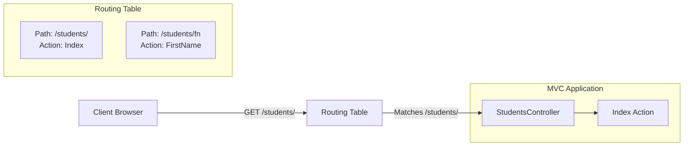

# ASP.NET Core MVC

MVC (Model-View-Controller) is an architectural pattern used for building web applications. 

## Routing
The **Routing Table** maps incoming URL requests from the client to specific Controller Actions.



## Actions and Views
In an MVC Controller, the return type of the Action method dictates what the client receives:

### Returning a View (`IActionResult`)
```csharp
public IActionResult Index()
{
    return View();
}
```
This looks for a corresponding `.cshtml` Razor page (usually in `Views -> ControllerName -> ActionName.cshtml`, falling back to `Shared` if not found). It renders the full HTML response, including the shared layout (navbars, footers, etc.).

### Returning a String
```csharp
public string Index()
{
    return "Konichiwa";
}
```
This completely overwrites the HTTP response body with plain text. No HTML views, layouts, or navbars are rendered.

## Passing Data to Views (ViewBag)
`ViewBag` is a dynamic object used to pass data from the Controller to the View.

**Controller:**
```csharp
public IActionResult Index()
{
    ViewBag.Message = "Congratulations!";
    ViewBag.MyName = "Radbrad";
    return View();
}
```

**View (`Index.cshtml`):**
```html
<h1>@ViewBag.Message</h1>
<h2>@ViewBag.MyName</h2>
```

## Visual Studio Scaffolding Quirks
When you create a model like `Customer.cs` and use the Visual Studio scaffolding tool to automatically generate a Controller and Views using Entity Framework, the tool automatically pluralizes the names.
- It will generate a `CustomersController`.
- The views folder will be named `Customers`.
- If you attempt to rename the controller to `CustomerController` or the view folder to `Customer` manually without updating the routing rules and all associated view references, you will likely encounter HTTP 404 (Not Found) errors when accessing `/customer`.
