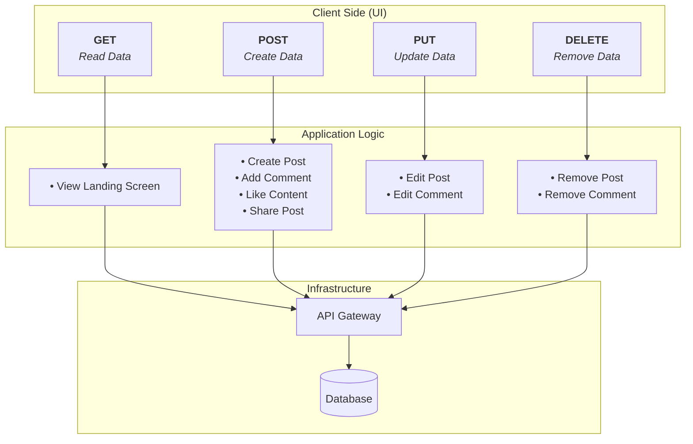

# HTTP APIs

## API and HTTP Actions

Standard HTTP verbs correspond to standard application logic and CRUD (Create, Read, Update, Delete) operations in a Web API or MVC backend.

## JSON (JavaScript Object Notation)
We use JSON in HTTP responses because:
- It is highly readable for humans.
- It is cross-platform and language-agnostic.
- It is extremely easy to parse programmatically.
- It naturally represents Key-Value pairs.

## Status Codes
- Why use status codes? **Standardization**.
- HTTP status codes (200, 404, 500) provide a universal language that allows client applications (browsers, mobile apps) to instantly understand if a request succeeded, failed due to bad input, or crashed the server, without having to manually parse the response body text.
